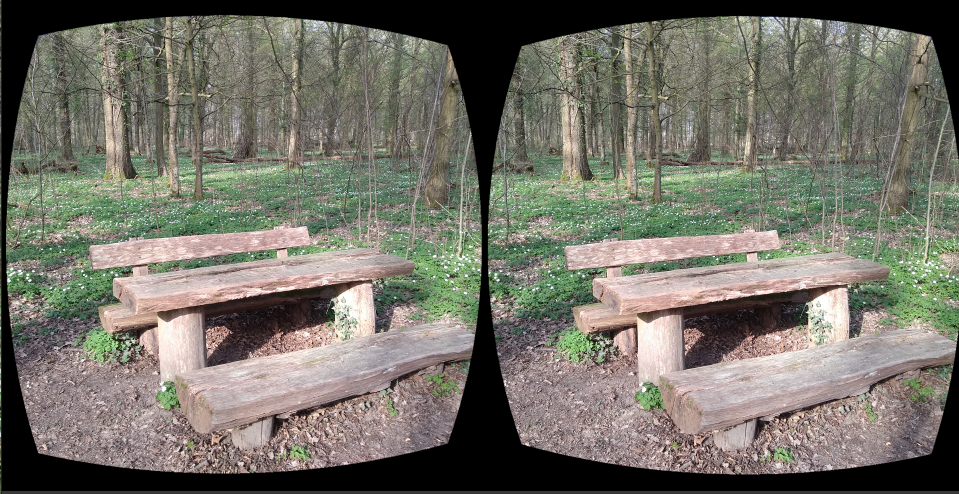

# Stereoscopy4Browser
This repository creates HTML5 WebApp (AppLSAC) for stereoscopic images created for a Wikiversity learning resource about Stereoscopy. Due to the VR headset with an inserted smartphone the stereoscopy images are displayed in fullscreen and split the screen in two halfs for left and right eye.

<h3><a href="https://niebert.github.io/stereoscopy4browser" target="_blank">Demo of Stereoscopy Images</a></h3>


## Javascript File
The Javascript file `js/stereoscopy4browser.js` contains the list of images that are displayed in fullscreen immersive preview. In the function `startAnimation()`  the list of images are defined
```javascript
function startAnimation() {
  intervalId = setInterval(() => {
    const images = [
      'bench_stereoscopy.png',
      'treeflowers_stereoscopy.png',
      'treeuprooted_stereoscopy.png',
      'broken_wood_stereoscopy.png',
      'holzfigur_stereoscopy.png',
      'wald_zweige_stereoscopy.png'
      // add more stereoscopic images here...
    ];
    const currentImageIndex = images.indexOf(image.src);
    const nextImageIndex = (currentImageIndex + 1) % images.length;
    image.src = "img/"+images[nextImageIndex];
  }, delayTime * 1000);
}
```

## Stereoscopy Images as Demo




